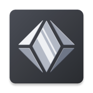
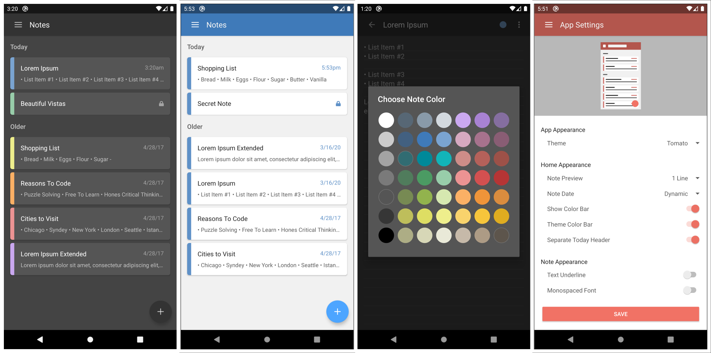

<ul style="list-style: none">
<h2> CrystalNote </h2>
</ul>

An aggressively minimalist, highly customizable notes app for Android.

 

###

Crystal Note was designed to be the most customizable notes app on Android. From app theme to widget appearance, every pixel can be tailored to your preference. All free forever, with no ads, tracking, or spam.

 

**Download**: [Google Play](https://play.google.com/store/apps/details?id=com.xephorium.crystalnote)

 

### App Features
- Custom Note Colors
- Note Password Protection
- Optional Note Archival
- Import & Export as Plaintext
- Multiple Widget Support
- Full Text File Editor (Older Devices Only)

### Personalization
- Vibrant App Themes
- Most Customizable Widgets on Android
- Personalized Note List & Edit Screens
- Real-Time App Appearance Preview
